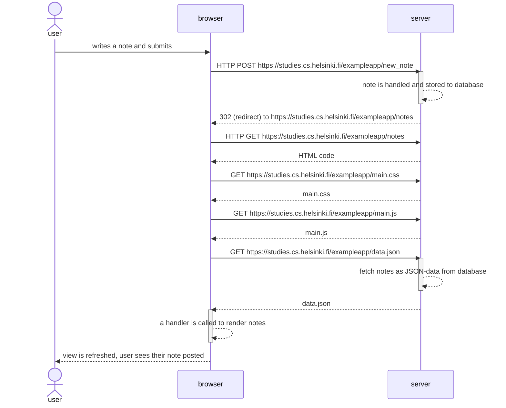

# 0.4 New Note

**Task:** Create a sequence diagram that describes what happens in a situation where the user creates a new note while on the page https://studies.cs.helsinki.fi/exampleapp/notes, i.e. writes something in the text field and presses the save button.

EmmalJunga
Kannattaako säästöt ottaa pois rahastosta, jos säästöille on käyttötarvetta lähivuosina? Tämän kevään aikana säästöistä on sulanut n. 5-10 % pois ja opintovapaa, jota varten säästelen lähestyy. Mietin että jatkuukohan säästöjen sulaminen todennäköisesti lähikuukausina.

On luonnollista, että osakekurssit välillä nousevat ja välillä laskevat. Kevät on ollut haastava, koska myös korkosijoitusten arvot ovat laskeneet samanaikaisesti osakesijoitusten kanssa. Tulevaa kehitystä on vaikea ennakoida, mutta toki on hyvä puntaroida, mitä tarkoitusta varten säästöjä on kerrytetty. Ajallinen hajauttaminen voi olla hyvä idea niin ostojen kuin myyntien kannalta.