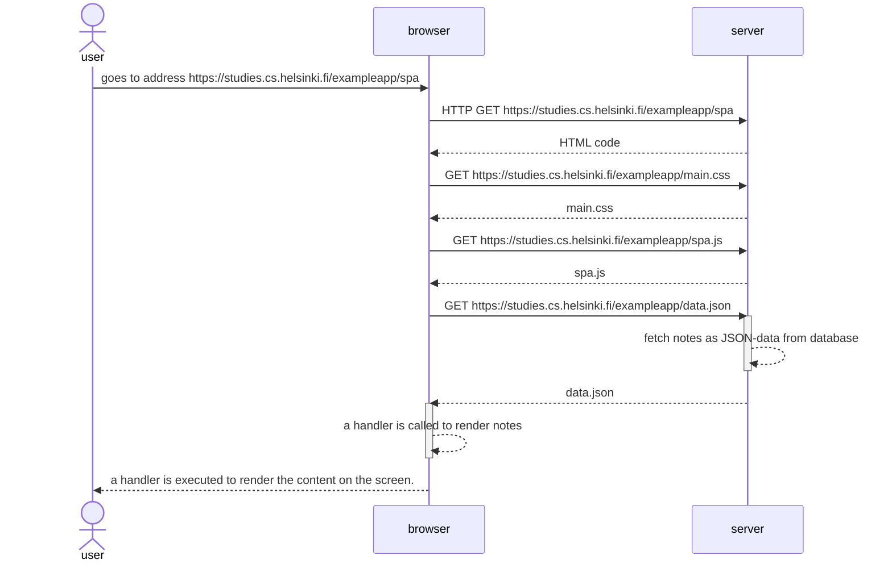

# 0.5 SPA sequence diagram

**TASK:** Make a diagram of the situation where the user goes to the address https://studies.cs.helsinki.fi/exampleapp/spa with a browser, i.e. the Single Page App version of the notes.  

