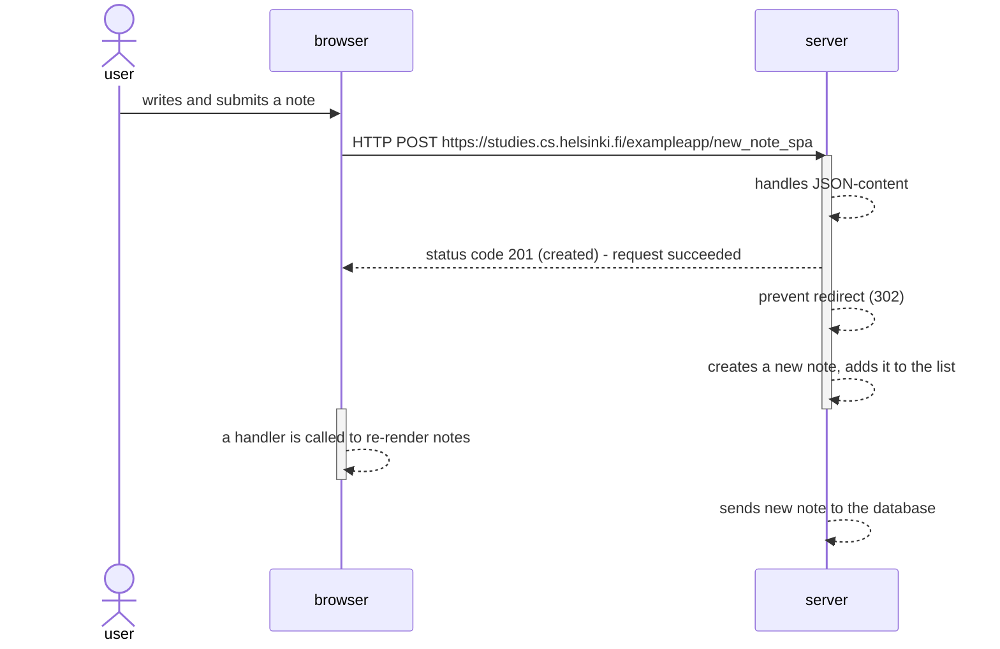

# 0.6 SPA sequence diagram for new note submission

**TASK:** Make a diagram of the situation where the user creates a new note in the single page version.

```mermaid
sequenceDiagram
actor user
participant browser
participant server
user ->> browser: writes and submits a note
browser ->> server: HTTP POST https://studies.cs.helsinki.fi/exampleapp/new_note_spa
activate server
server -->> server: handles JSON-content
server -->> browser: status code 201 (created) - request succeeded 
server -->> server: prevent redirect (302)
server -->> server: creates a new note, adds it to the list
deactivate server
activate browser
browser -->> browser: a handler is called to re-render notes
deactivate browser
server -->> server: sends new note to the database
```
